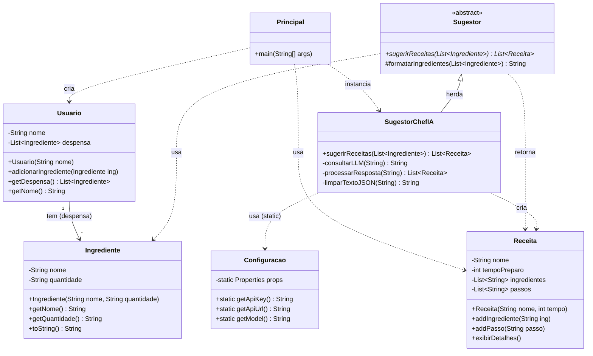

# ChefAI - Sugestor de Receitas Inteligente

O **ChefAI** é um sistema desenvolvido em Java que auxilia usuários a encontrar receitas baseadas estritamente nos ingredientes que eles possuem em casa. O diferencial do projeto é a integração com uma **Inteligência Artificial (LLM)**, que gera sugestões personalizadas, formatadas e com tempo de preparo estimado.

O sistema utiliza conceitos de Orientação a Objetos e integração via API para processar a linguagem natural e estruturá-la em objetos Java.

## Instruções de Configuração e Execução

### Pré-requisitos
* **Java JDK 11** ou superior .
* **IDE:** BlueJ (recomendado).
* **Conexão com a Internet:** Necessária para consultar a API da IA.
* **Chave de API:** É necessário configurar a API Key na classe `Configuracao`.

### Como Configurar e Rodar
1.  **Clone o repositório:**
    ```bash
    git clone [https://github.com/bortolettojoaovitor/ChefAIRec.git](https://github.com/USUARIO/REPOITORIO.git)
    ```
2.  **Configuração da API:**
    * Abra no programa a classe`Configuracao.java`.
    * Insira sua URL e API Key do provedor de LLM (ex: OpenAI, Groq, etc)
3.  **Executar:**
    * Abra o projeto na IDE.
    * Localize a classe `Principal` (ou a classe principal de execução).
    * Execute o método `Principal`.
    * Siga as instruções no terminal para informar seus ingredientes.

---

##  Diagrama de Classes



##  Exemplos de Uso

### Interação no Terminal
Ao executar a classe `Principal`, o sistema solicitará os dados via console. Abaixo está uma simulação de uma execução real:

```text
Bem-vindo ao ChefAI
Digite seu nome: João Vitor
Olá, João Vitor! Vamos cadastrar os ingredientes
Nome do ingrediente ou 'fim' para terminar: leite
Quantidade: 100ml
Nome do ingrediente ou 'fim' para terminar: farinha
Quantidade: 200g
Nome do ingrediente ou 'fim' para terminar: banana
Quantidade: 4 unidades
Nome do ingrediente ou 'fim' para terminar: ovos
Quantidade: 3 unidades
Nome do ingrediente ou 'fim' para terminar: doce de leite
Quantidade: 50g
Nome do ingrediente ou 'fim' para terminar: fim

Consultando, aguarde...

 Receitas Encontradas para João Vitor 

 OPÇÃO 1 
Receita: Bolo de Banana | Tempo: 25 minutos
Ingredientes:
 * leite
 * ovos
 * banana
Como preparar:
 > Pré-aqueça o forno a 180°C. Misture 2 ovos, 1 xícara de leite, 1 xícara de farinha e 2 bananas amassadas em uma tigela. Coloque a mistura em uma forma untada com óleo e asse por 20 minutos. Deixe esfriar por 5 minutos.

 OPÇÃO 2 
Receita: Panqueca de Banana | Tempo: 20 minutos
Ingredientes:
 * leite
 * ovos
 * banana
Como preparar:
 > Misture 1 ovo, 1/2 xícara de leite, 1/2 xícara de farinha e 1 banana amassada em uma tigela. Aqueça uma frigideira com óleo em fogo médio. Despeje a mistura na frigideira e cozinhe por 2-3 minutos de cada lado, até que fique dourado.

  OPÇÃO 3 
Receita: Crepioca de Doce de Leite | Tempo: 15 min
Ingredientes:
 * leite
 * farinha
 * doce de leite
 * ovos

Como preparar:
 > Misture 1 ovo, 1/2 xícara de leite, 1 colher de sopa de farinha e 1 colher de sopa de doce de leite em uma tigela. Aqueça uma frigideira com óleo em fogo médio. Despeje a mistura na frigideira e cozinhe por 2 minutos de cada lado, até que esteja dourada e o doce de leite esteja derretido.

```


